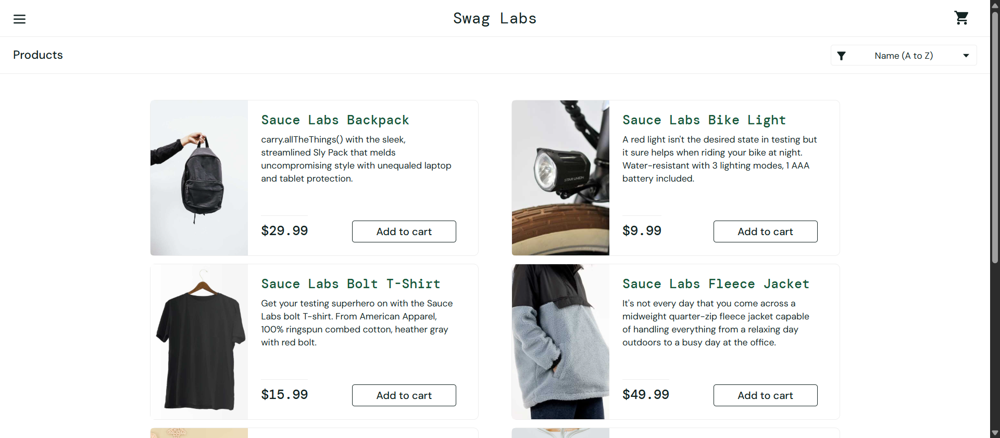
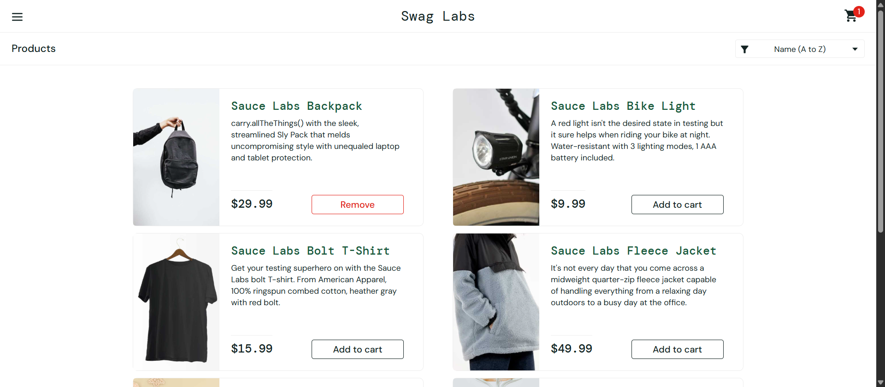
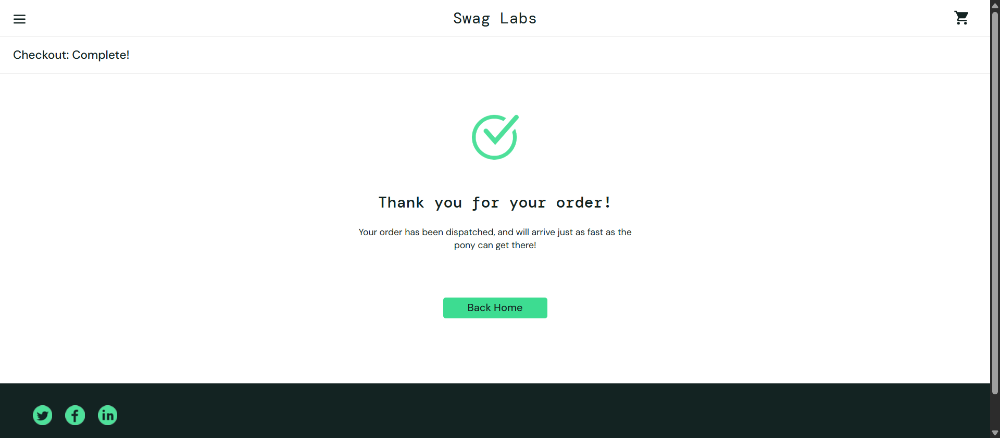
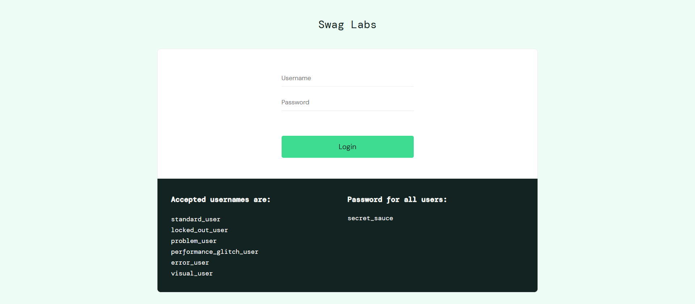
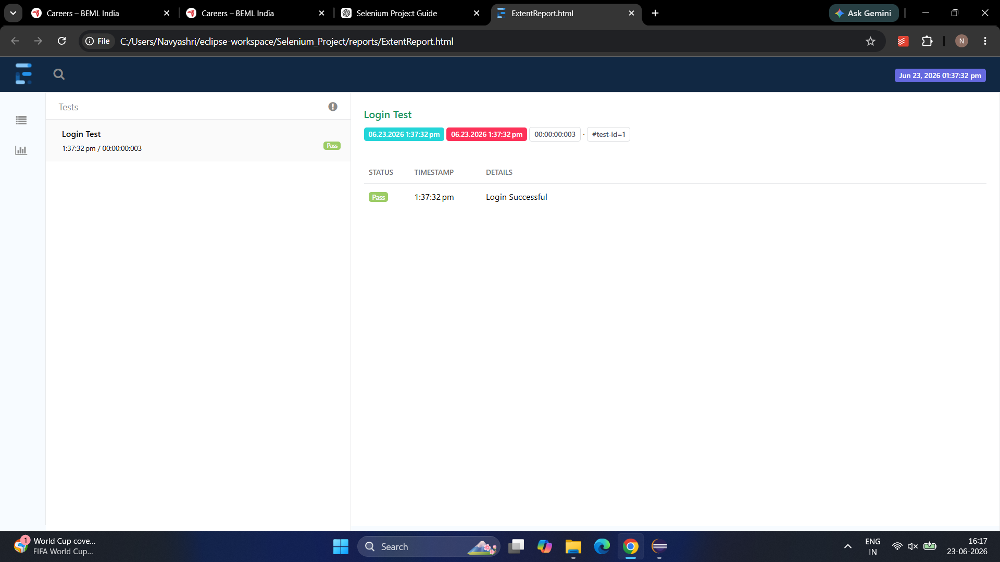

# Selenium E-Commerce Automation Framework

## Project Overview

This project is an end-to-end Selenium Automation Framework developed using Java, Selenium WebDriver, TestNG, Maven, Apache POI, and Extent Reports.

The framework automates key e-commerce workflows on SauceDemo and follows the Page Object Model (POM) design pattern for maintainability and scalability.

## Features

* Login Automation
* Add To Cart Automation
* Checkout Automation
* Logout Automation
* Data-Driven Testing using Excel
* Screenshot Capture
* Extent Reports
* TestNG Suite Execution
* Page Object Model (POM)

## Tech Stack

* Java
* Selenium WebDriver
* TestNG
* Maven
* Apache POI
* Extent Reports
* Git
* GitHub

## Test Scenarios Covered

1. Login Validation
2. Add Product to Cart
3. Checkout Process
4. Logout Functionality
5. Data-Driven Login Testing

## Screenshots

### Login Success

### Add To Cart

### Checkout Success

### Logout Success

### Extent Report

## Author

Navyashri S Prasad
